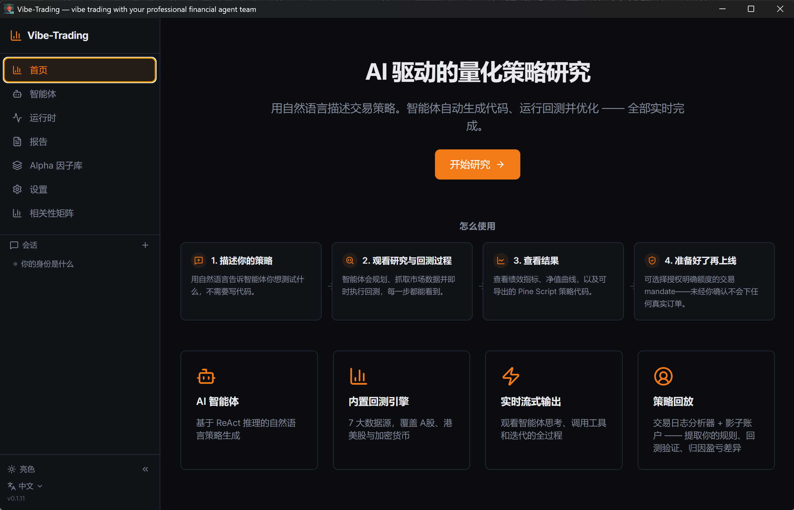
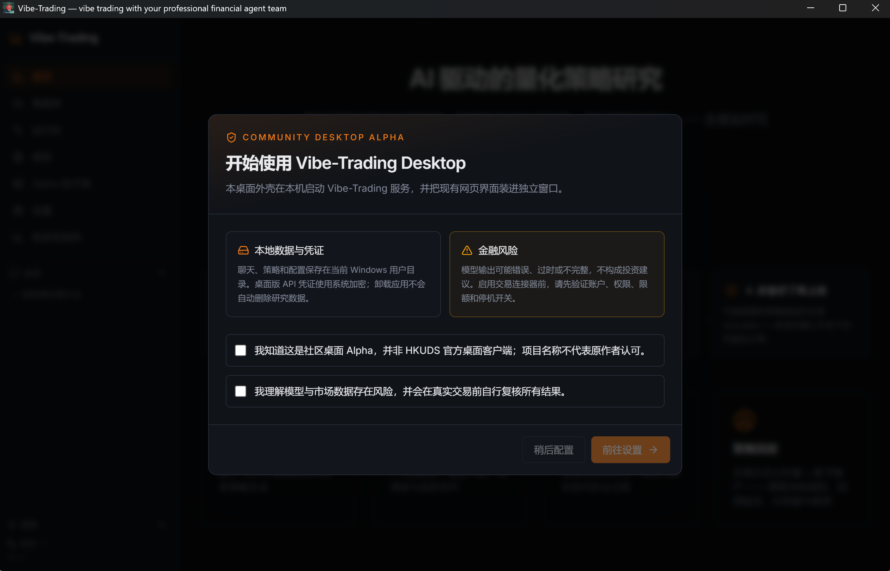

# Vibe-Trading Desktop Community

[English](README.en.md) | [简体中文](README.zh-CN.md)

An **unofficial Windows desktop prototype** for [HKUDS/Vibe-Trading](https://github.com/HKUDS/Vibe-Trading). It packages the existing React interface and local Python/FastAPI service into a desktop application with an installer, process lifecycle management, safer local credential storage, and several usability improvements.

> This is a community Alpha and is not an official HKUDS desktop client. It is research software, not investment advice.

## Current status

- Upstream package baseline: Vibe-Trading `0.1.11`
- Desktop prototype: `0.3.0 Alpha`
- Platform: Windows 10/11 x64
- Packaging: Electron + embedded Python runtime + existing React/FastAPI application
- Distribution: unsigned community installer; Windows may show a SmartScreen warning

The public Git repository does **not** contain an installer executable. Installers are generated release artifacts and, once published, are available only from the repository's GitHub Releases page.

## What the desktop version adds

- One-click desktop startup and shutdown of the local backend
- Single-instance handling, random loopback port, health checks, startup diagnostics, and child-process cleanup
- Windows installer with an embedded Python runtime
- Windows-encrypted storage for desktop API credentials
- First-run privacy, security, and financial-risk disclosure
- Improved provider/model discovery and model selection
- Visible runtime provider, model, reasoning setting, and response duration in chat
- Fixed reply-copy behavior and faster first navigation through route preloading
- Registry-driven IM channel management for the adapters already supported by Vibe-Trading
- A draft GitHub Releases update and release workflow, pending end-to-end release validation

## Screenshots

First-run disclosure:

Main interface:

## Known limitations

- The installer is not code-signed yet.
- Final clean-Windows validation of this exact `0.3.0` build is still pending.
- The in-app updater has not completed a real `N -> N+1` release test and is disabled until a release repository is selected.
- Package size and cold-start/first-navigation performance still need optimization.
- Real-account end-to-end testing has not been completed for every optional IM adapter.
- This repository contains a source overlay from a source snapshot without the original Git history; it is not presented as an upstream-ready patch series.

See [README.en.md](README.en.md) or [README.zh-CN.md](README.zh-CN.md) for installation, validation, architecture, and development details.

## License and upstream relationship

The code remains under the upstream project's MIT License. `Vibe-Trading` belongs to its original authors. This repository does not claim official status or endorsement by HKUDS.
